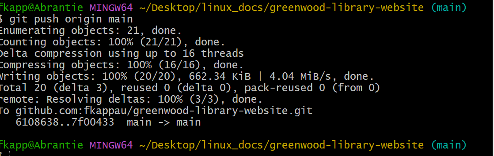
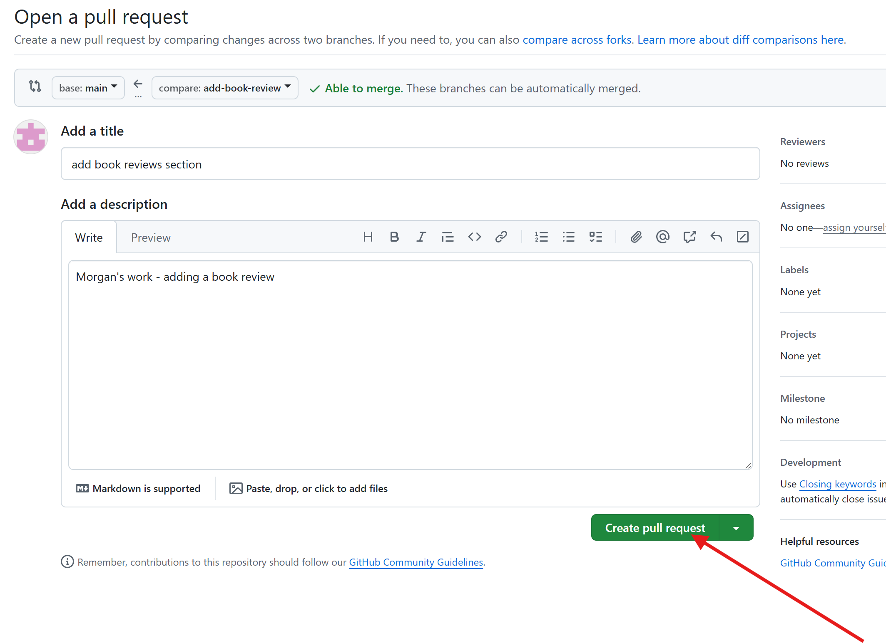
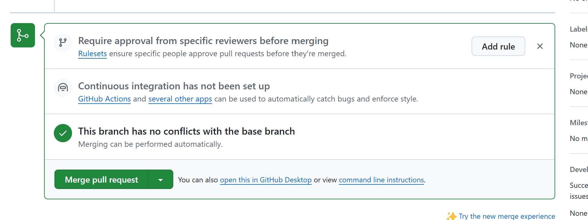

# greenwood-library-website

# created a git repository
* a repository was created on a git repository
* this repository was clone to my local environment using ssh

# adding files to the main repository
  these files were added using vim, making it possible to add contents to each file after they were created

 * home.html
 * about_us.html
 * events.html
 * contact.html

# these files created were initialized, stage and commited locally

 * git init
 * git status
 * git add *
 * git commit -m 

 

 # these file were then pushed to github main

 * git push origin main 
 

 # Morgan's Work = Adding a book review
 the branch was created using `git branch add-book-review`
 this branch was checked into using ``git checkout command``
 

vim was then use to create a book review file, to give option of adding random text immediately after creating the file.

* this section of morgan's work was staged, commited and pushed to a branch called ` add-book-review`

* a pull request was then raised and merged to the main branch

# an update-events section was created 